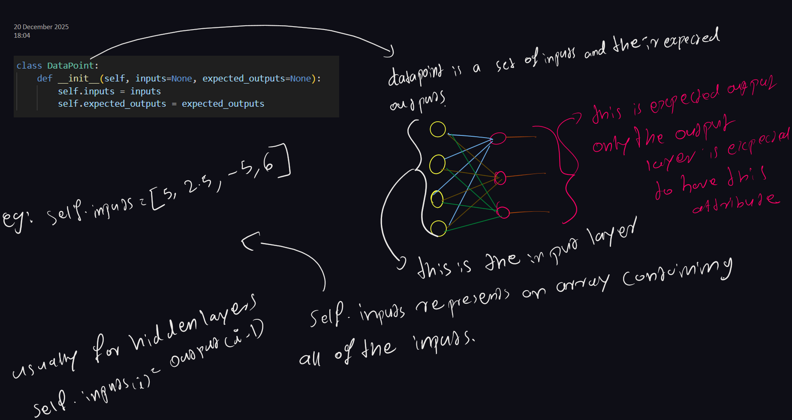
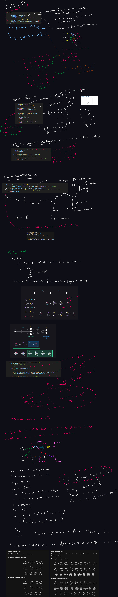
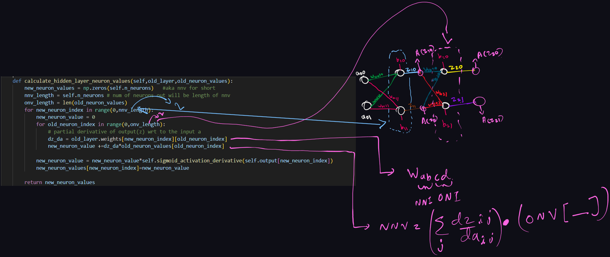
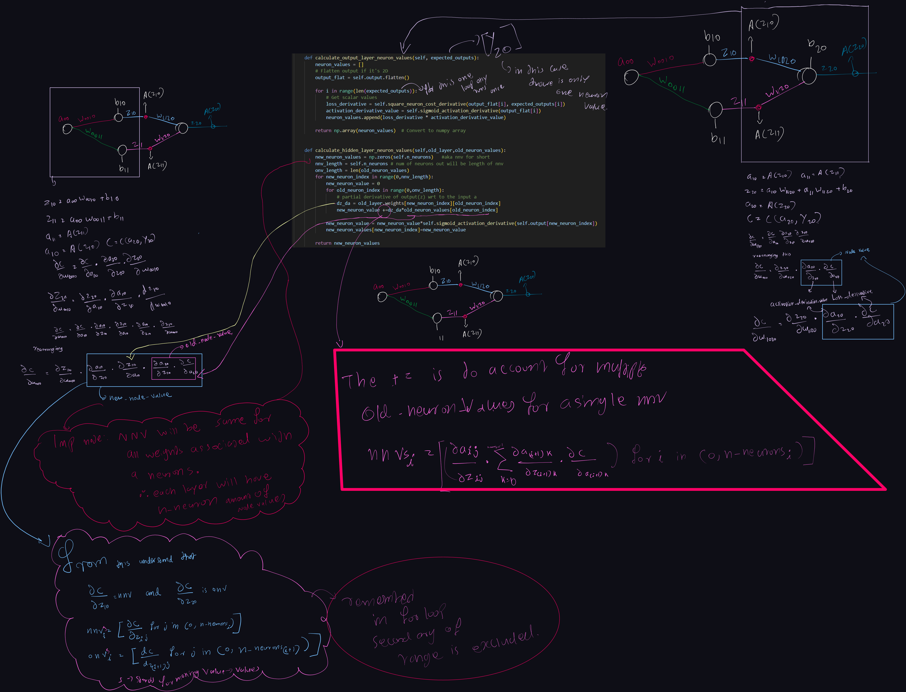
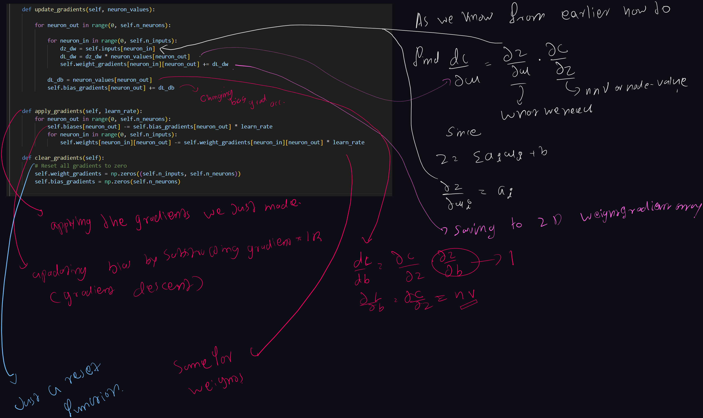

# Documentation 
This is a handwritten notes documenting the math and other details behind each functionality in depth.

## Table of Contents
- [Datapoint Representation](#datapoint-representation)
- [Layer Structure](#layer-structure)
- [Backpropagation and Node/Neuron Values explained](#backpropagation-and-nodeneuron-values-explained)
- [Gradient Descent](#gradient-descent)

# Datapoint Representation

# Layer Structure

# Backpropagation and Node/Neuron Values explained

# Gradient Descent

# Neural Network Architecture

<!-- 
Since the documentation is handwritten updates will result in large(comparitively) size changes since they are all images. -->